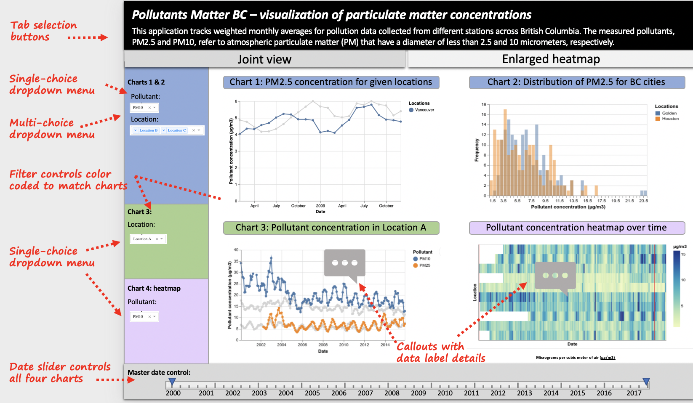
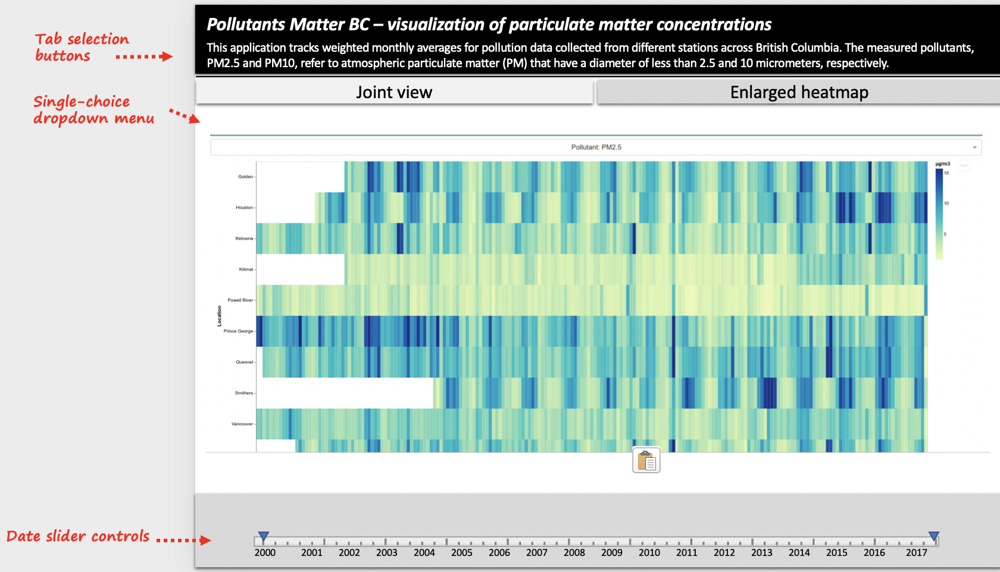

# DSCI 532: Group 215 - ParticulatesMatter

Members: Tejas Phaterpekar, Karlos Muradyan, Jarome Leslie

Dataset: Time series of particulate matter concentrations across BC

## Important Links

[Pollutants Matter BC Heruko Deployment](https://pollutantsmatterbc.herokuapp.com)

[Reflection Document](https://github.com/UBC-MDS/DSCI532_Group215_ParticulatesMatter/blob/master/reflection.md)

[Requirements/Dependencies](https://github.com/UBC-MDS/DSCI532_Group215_ParticulatesMatter/blob/master/requirements.txt)

## Description/Functionality

In our app, plan to have types four plots that give different insights into the air pollution situation in the Greater Vancouver area. These plots are separated into two tabs where tab 1 presents the joint view of all the plots and the second tab displays an enlarged heatmap. The first chart is a time-series plot wchich tracks pollutant concentration over time, across multiple different locations. The second plot displays distribution of pollutant concentrations as histograms for the locations selected in the first chart. These two charts will be controlled by shared menu controls. The third chart will display a time-series plot of pollutant concentration, except it will feature only one location (selected by the user) and will show the trend of both types of pollutants over time. We will also have a heatmap that highlights all locations in the study to allow the user to compare pollutant concentrations by intensity. The heatmap will be equipped with a tooltip that informs the user of exact pollutant values when they hove over different areas of the plot. As mentioned above, the heatmap is also presented on the second tab in a larger form to improve its readability for the use. 

The interactivity of the four graphs will focus on giving the user flexibility in which locations and pollutant types they want to analyze. Changes in the plot, with respect to what data is being displayed, will depend on what filters the user selects from dropdown menus and checkbox features. Furthermore, a range slider is provided to give users global control over what time range is being observed across all four plots. Finally, the interactive controls have been color coded to connect the interactive components to their corresponding graph. 

### Design Sketch

Screenshot of dashboard design sketch tab 1:

Screenshot of dashboard design sketch tab 2:

